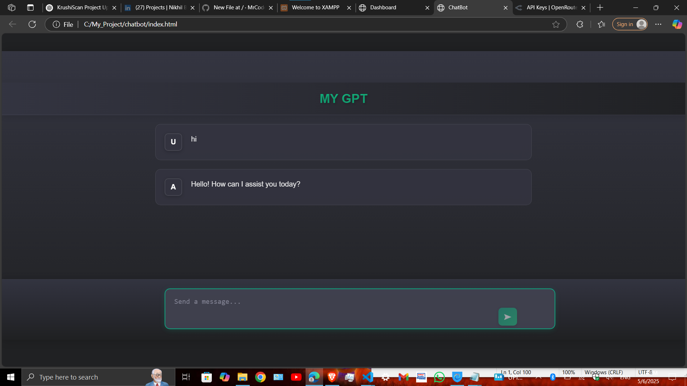

```markdown
# MY GPT


A responsive and elegant chatbot interface built with **vanilla HTML, CSS, and JavaScript** that uses the [OpenRouter](https://openrouter.ai/) API to provide AI chat functionality. This project was migrated from a React-based version to a fully static implementation for simplicity and portability.

## ✨ Features


- Clean and modern UI (ported from styled-components React version)
- Chat messages with user and assistant distinction
- Animated typing dots while waiting for bot response
- Smooth scrolling and responsive layout
- OpenRouter API integration (`qwen/qwen2.5-vl-3b-instruct:free` model)

## 🚀 Demo

You can clone and run this locally to test MY GPT:

```bash
git clone https://github.com/MrCoder420/chatbot.git
cd chatbot
open index.html
```

> ⚠️ **Note**: You must have an OpenRouter API key to use this chatbot.

## 🔧 Setup

1. Get your OpenRouter API key from [https://openrouter.ai](https://openrouter.ai)
2. Open the `script.js` file.
3. Replace the `apikey` value with your own:

```js
const apikey = "your-openrouter-api-key-here";
```

4. Open `index.html` in your browser and start chatting!

## 📁 File Structure

```plaintext
chatbot/
├── index.html         # Main HTML structure
├── styles.css         # Full chatbot styling
├── script.js          # Chatbot logic & API integration
├── README.md          # Project documentation
```

## 📜 License

MIT
```
